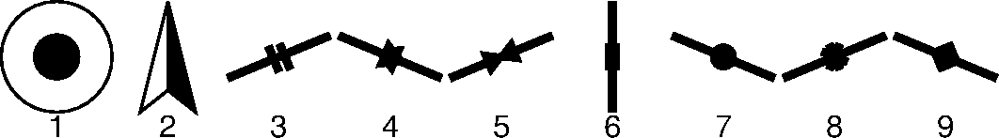

# GMT自定义符号

用于收集自制的GMT自定义符号，本项目持续更新，欢迎投稿！

1. city.def : 城市符号   作者：赵志远

2. compass.def : 指北针符号   作者：赵志远

3. stress_relief.def : 应力解除符号   作者：汪园园

4. hydra_fract.def : 水压致裂符号   作者：汪园园

5. borehole_collapse.def : 钻孔崩落符号   作者：汪园园

6. fault_slip.def : 断层滑动符号   作者：汪园园

7. focal_mec.def : 震源机制符号   作者：汪园园

8. BS.def : 钻孔槽符号   作者：汪园园

9. DIF.def ： 钻孔诱发张裂隙符号   作者：汪园园

